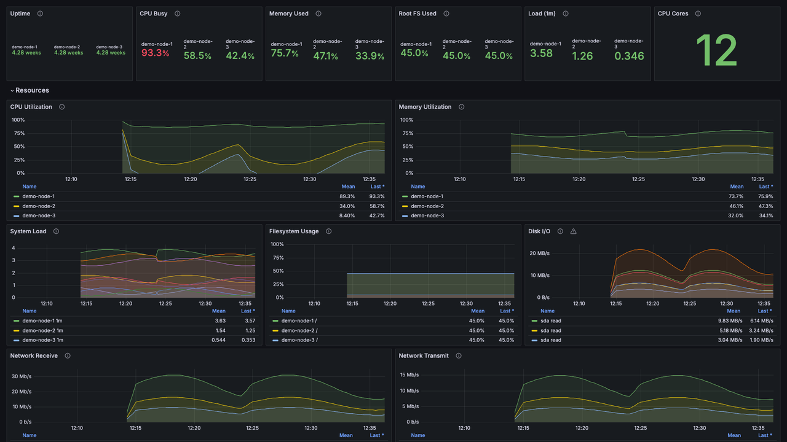
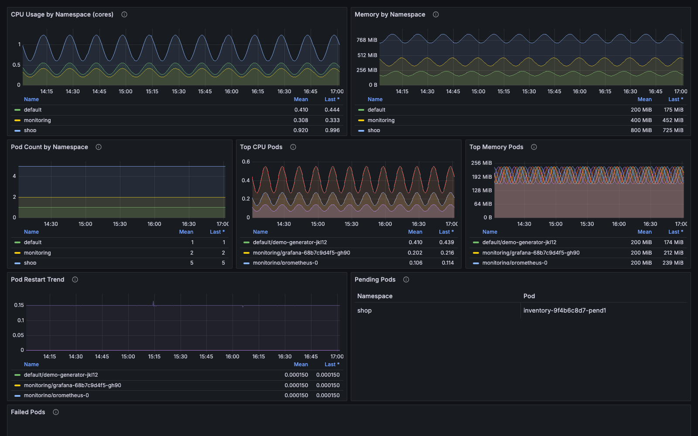

# Free Grafana dashboards for node_exporter & Kubernetes — Prometheus, Grafana 10/11

[](https://github.com/Fractal-Techware/grafana-dashboards/actions/workflows/validate.yml)
[](LICENSE)


Two production-ready, MIT-licensed Grafana dashboards for Prometheus:

| Dashboard | For | Needs |
|---|---|---|
| [**Infrastructure Overview**](dashboards/infrastructure-overview.json) | Linux hosts, VMs, homelabs | [node_exporter](https://github.com/prometheus/node_exporter) |
| [**Kubernetes Namespaces & Pods**](dashboards/kubernetes-namespaces-pods.json) | Any Kubernetes cluster | [kube-state-metrics](https://github.com/kubernetes/kube-state-metrics) + cAdvisor (kubelet) — both included in [kube-prometheus-stack](https://github.com/prometheus-community/helm-charts/tree/main/charts/kube-prometheus-stack) |

Both dashboards:

- use a **selectable Prometheus data source variable** (`DS_PROMETHEUS`) — no
  hard-coded data source names or uids, so they import cleanly into any Grafana,
  including Grafana Cloud;
- work with any Prometheus-compatible backend (Prometheus, Grafana Mimir,
  Thanos, VictoriaMetrics);
- use `$__rate_interval`, sensible units and thresholds, and a description on
  every panel;
- are validated in CI and were tested by provisioning them into clean
  Grafana **10.4.5** and **11.1.0** instances.

They are a free sample of the
[Fractal Techware Grafana Observability Dashboard Pack](https://store.fractaltechware.com/l/grafana-dashboard-pack?utm_source=github&utm_medium=readme&utm_campaign=free-repo).

---

## Infrastructure Overview (node_exporter)



Fleet-level host health at a glance: uptime, CPU busy, memory used, root
filesystem used, load and core count as stat panels, then CPU, memory, system
load, filesystem usage, disk I/O and network receive/transmit over time.
Filter by one or many hosts with the `instance` variable.

Metrics used (all from node_exporter's default collectors):
`node_cpu_seconds_total`, `node_memory_MemTotal_bytes`,
`node_memory_MemAvailable_bytes`, `node_load1/5/15`,
`node_filesystem_size_bytes`, `node_filesystem_avail_bytes`,
`node_disk_read_bytes_total`, `node_disk_written_bytes_total`,
`node_network_receive_bytes_total`, `node_network_transmit_bytes_total`,
`node_boot_time_seconds`, `node_uname_info`.

## Kubernetes Namespaces & Pods



Where is my cluster's CPU and memory going, and which pods are unhealthy?
CPU and memory by namespace, pod count per namespace, top 15 pods by CPU and by
memory, pod restart trend, and tables of Pending and Failed pods. Filter with the
`namespace` and `pod` variables (multi-select).

Metrics used: `container_cpu_usage_seconds_total`,
`container_memory_working_set_bytes` (cAdvisor, scraped from the kubelet),
`kube_pod_info`, `kube_pod_status_phase`,
`kube_pod_container_status_restarts_total` (kube-state-metrics).

> Screenshots are real captures of these dashboards running against a
> synthetic demo environment, not a production system.

---

## Install

### Option 1 — Import in the Grafana UI

1. Download the JSON file from [`dashboards/`](dashboards/) (or clone this repo).
2. In Grafana go to **Dashboards → New → Import**.
3. Upload the JSON file (or paste its contents).
4. When prompted for **Prometheus data source**, pick your Prometheus.
5. Click **Import**.

### Option 2 — Provisioning (dashboards as code)

```bash
git clone https://github.com/Fractal-Techware/grafana-dashboards.git
cd grafana-dashboards-free

sudo cp provisioning/datasources/prometheus.yaml /etc/grafana/provisioning/datasources/   # skip if you already have a Prometheus data source
sudo cp provisioning/dashboards/dashboards.yaml  /etc/grafana/provisioning/dashboards/
sudo mkdir -p /var/lib/grafana/dashboards
sudo cp dashboards/*.json /var/lib/grafana/dashboards/
sudo systemctl restart grafana-server
```

- [`provisioning/datasources/prometheus.yaml`](provisioning/datasources/prometheus.yaml) —
  edit `url` to point at your Prometheus.
- [`provisioning/dashboards/dashboards.yaml`](provisioning/dashboards/dashboards.yaml) —
  loads every JSON file in `/var/lib/grafana/dashboards` into a
  **Fractal Techware** folder. It sets an explicit folder, so it deliberately
  does **not** use `foldersFromFilesStructure` (Grafana refuses to provision
  when both are set).

On Kubernetes with kube-prometheus-stack you can instead ship the JSON files as
ConfigMaps labelled `grafana_dashboard: "1"` for the Grafana sidecar to pick up.

### Option 3 — Try it locally with Docker Compose

Starts node_exporter, Prometheus and Grafana 11 with everything provisioned:

```bash
docker compose up -d
open http://localhost:3000        # anonymous admin, no login
# ports taken? GRAFANA_PORT=3001 PROMETHEUS_PORT=9091 docker compose up -d
```

The dashboards are in **Dashboards → Fractal Techware**. Infrastructure Overview
fills with data after a minute or two (on Docker Desktop it shows the Docker VM,
not your laptop). Kubernetes Namespaces & Pods needs a real cluster, so it stays
empty in this stack. Tear down with `docker compose down`.

This stack is for local evaluation only — do not expose it to a network.

## Compatibility

| Component | Tested |
|---|---|
| Grafana OSS | 10.4.5, 11.1.0 (should work on any 10.x / 11.x and Grafana Cloud) |
| Prometheus | 2.53 (any 2.40+) |
| node_exporter | 1.8.1 (any 1.5+) |
| Kubernetes | kube-state-metrics 2.x + kubelet cAdvisor, e.g. via kube-prometheus-stack |

## Troubleshooting

- **"No data" everywhere** — check the *Data source* dropdown at the top of the
  dashboard, then run `up` in Explore to confirm Prometheus scrapes your targets.
- **Host list empty** — the `instance` variable reads `node_uname_info`; make
  sure node_exporter is scraped.
- **Namespace list empty** — the `namespace` variable reads `kube_pod_info`
  from kube-state-metrics.
- **Kubernetes CPU/memory panels empty but pod counts work** — cAdvisor metrics
  (`container_*`) are missing; scrape the kubelet's `/metrics/cadvisor` endpoint.

## Validate

```bash
pip install pyyaml
python3 scripts/validate.py
```

Checks that every dashboard is valid JSON with unique panel ids, a
`schemaVersion`, the `DS_PROMETHEUS` import input and variable, no hard-coded
data source uids, and that the provisioning YAML parses. The same check runs in
[GitHub Actions](.github/workflows/validate.yml) on every push and pull request.

---

## Need more than two dashboards?

These two dashboards are free forever under the MIT license. If they are useful,
the full pack builds on the same conventions (shared variables, cross-linked
dashboards, same data source handling):

| | Free (this repo) | Starter — $9 | Pro — $39 | Studio — $79 |
|---|:-:|:-:|:-:|:-:|
| Infrastructure Overview | ✓ | ✓ | ✓ | ✓ |
| Node Exporter Details (per-host deep dive) | | ✓ | ✓ | ✓ |
| Kubernetes Namespaces & Pods | ✓ | | ✓ | ✓ |
| Kubernetes Cluster Overview, Nodes, Workloads | | | ✓ | ✓ |
| Application / Service RED dashboard | | | ✓ | ✓ |
| Blackbox endpoint & TLS expiry monitoring | | | ✓ | ✓ |
| Prometheus + Grafana alert rules | | | ✓ | ✓ |
| SRE summary, capacity planning, container deep dive, alert operations, Loki logs | | | | ✓ |
| Terraform, Helm values, docker demo stack | | | | ✓ |
| **Dashboards** | **2** | **2** | **8** | **13** |
| License | MIT | Personal / internal | Internal | Includes client use |

[See the full pack on Gumroad →](https://store.fractaltechware.com/l/grafana-dashboard-pack?utm_source=github&utm_medium=readme&utm_campaign=free-repo)

## Contributing

Issues and pull requests are welcome — bug reports with your Grafana version,
exporter versions and the failing panel query are the most helpful. Please run
`python3 scripts/validate.py` before opening a PR.

## License

[MIT](LICENSE) © Fractal Techware. Use, modify and redistribute freely,
including commercially.

<sub>Keywords: grafana dashboard, prometheus dashboard, node exporter dashboard,
node_exporter grafana, kubernetes grafana dashboard, kube-state-metrics dashboard,
cadvisor, kube-prometheus-stack, grafana provisioning, grafana 11, grafana 10,
linux server monitoring, homelab monitoring.</sub>
